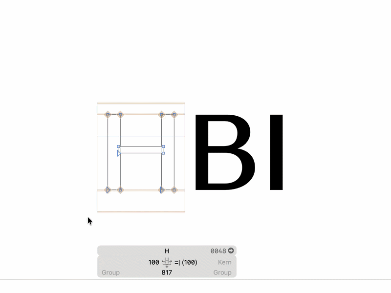

# Corner Hotkeys

A Glyphs 3 plugin for working with corner components using keyboard shortcuts.

## Shortcuts

- `1`–`5` — insert or replace a predefined corner component
- `Q` — mirror the selected corner component horizontally

Select a node or corner component before using a shortcut.

## Settings

Open:

**Glyph → Corner Hotkeys Settings…**

Assign a `_corner` glyph to each key using the dropdown menus. The shortcuts can also be temporarily enabled or disabled from the Glyph menu.

The plugin does not intercept keys while typing in text fields or palettes.

## Installation

Unzip the plugin, drag `CornerHotkeys.glyphsPlugin` onto the Glyphs 3 icon in the Dock, and restart Glyphs.

## Requirements

- Glyphs 3
- Python module installed through the Glyphs Plugin Manager